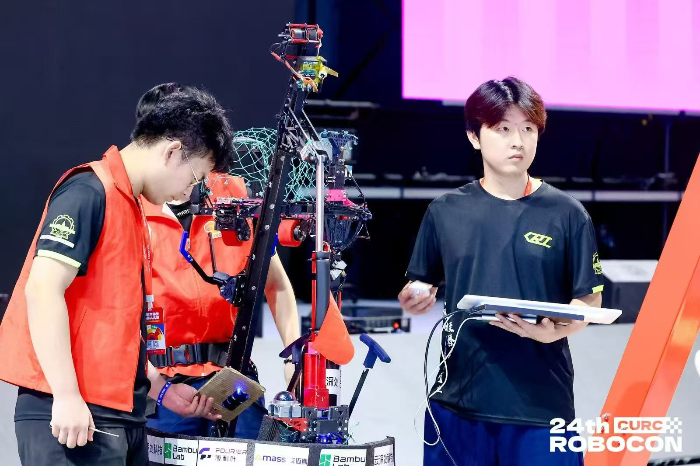

<h1 align="center">HITCRT · Control Group</h1>

  <strong>哈尔滨工业大学竞技机器人队 · 控制组</strong>

  Code &nbsp; / &nbsp; Experiments &nbsp; / &nbsp; Knowledge

  <em>极限犹可突破，至臻亦不可止。</em>

  <a href="#代码管理">代码管理</a> ·
  <a href="#测试记录">测试记录</a> ·
  <a href="#技术分享">技术分享</a>

从控制算法到实机验证，在现场发现问题、验证改进。

查看机器人实机

  

---

## 我们的工作空间

这里是 **HITCRT 控制组**用于内部代码管理、测试记录与技术分享的协作空间。

围绕机器人控制中的实际问题，我们在这里维护项目代码、记录实验结果、交流算法与方法，让每一次修改有迹可循，每一份经验能够传承。

## 代码管理

- **项目维护**：按项目组织代码，说明用途、运行环境与使用方法。
- **版本协作**：通过分支与 Pull Request 管理修改，说明改动原因和验证结果。
- **算法积累**：整理可复用的控制算法、仿真示例与分析工具。

[浏览组织仓库 →](https://github.com/orgs/HITCRT-Control/repositories)

## 测试记录

让结论有数据支撑，让实验能够复现。

| 记录内容 | 需要说明什么 |
| :--- | :--- |
| **测试目标** | 验证的问题、评价指标与预期结果 |
| **测试条件** | 代码版本、控制参数、设备状态与实验工况 |
| **实验过程** | 操作步骤、数据采集方式与异常现象 |
| **结果分析** | 数据与曲线、对比结果、适用条件与局限 |
| **后续事项** | 当前结论、待解决问题与下一步验证计划 |

## 技术分享

- **理论与算法**：系统建模、控制方法、状态估计与轨迹规划。
- **实践与复盘**：参数整定、仿真验证、实机调试与问题分析。
- **资料与笔记**：论文阅读、学习笔记、组内分享与工具使用。

分享时尽量交代问题背景、推导或实现过程，并附上参考资料、代码或实验结果。

## 协作约定

1. **问题留痕**：在对应项目的 Issue 中记录现象、复现步骤与处理进展。
2. **修改可追溯**：提交信息说明改了什么、为什么改；测试记录关联具体提交版本。
3. **结论有依据**：区分推测与验证结果，保留必要的数据和实验条件。
4. **文档随项目更新**：关键参数、运行方法和已知问题及时同步。

---

  <strong>惟实 · 惟简 · 惟新 &nbsp; / &nbsp; 惟稳 · 惟强 · 惟快</strong>

