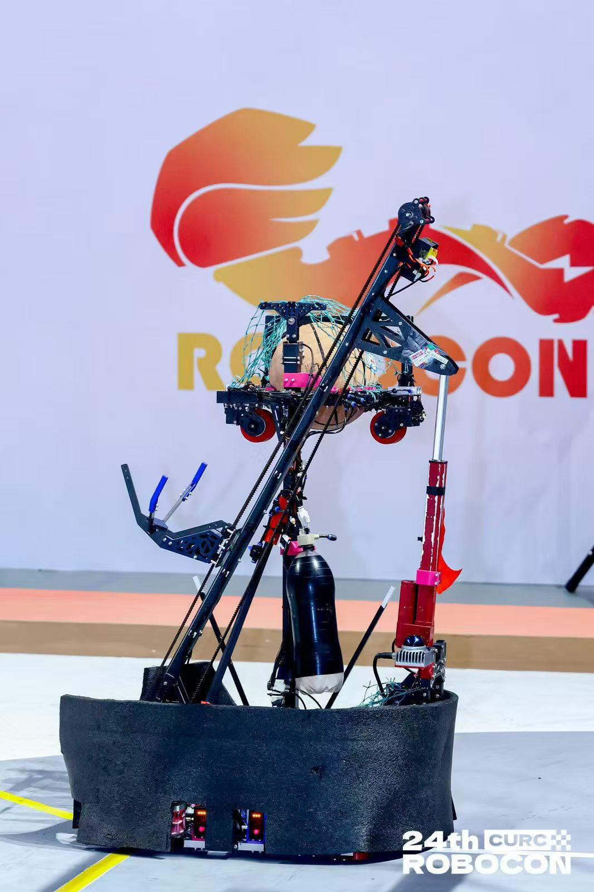

<h1 align="center">HITCRT · Control Group</h1>

  <strong>哈尔滨工业大学竞技机器人队 · 控制组</strong>

  Code &nbsp; / &nbsp; Experiments &nbsp; / &nbsp; Knowledge

  <em>极限犹可突破，至臻亦不可止。</em>

  <a href="#代码管理">代码管理</a> ·
  <a href="#测试记录">测试记录</a> ·
  <a href="#技术分享">技术分享</a>

从控制算法到实机验证，在现场发现问题、验证改进。

查看机器人实机

  

---

---

  <strong>惟实 · 惟简 · 惟新 &nbsp; / &nbsp; 惟稳 · 惟强 · 惟快</strong>

